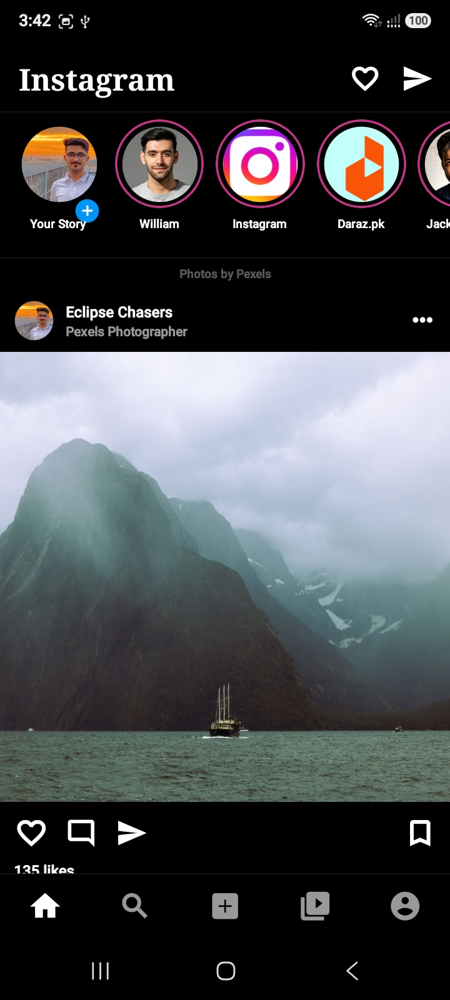
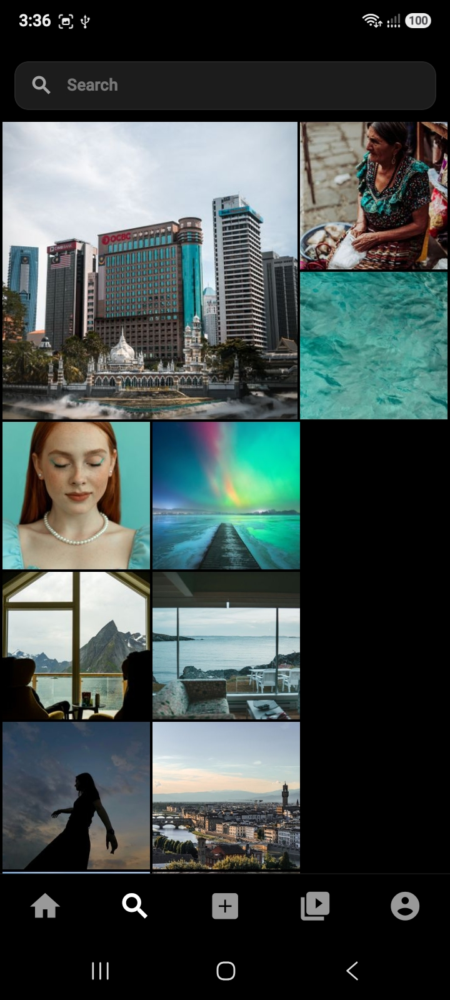
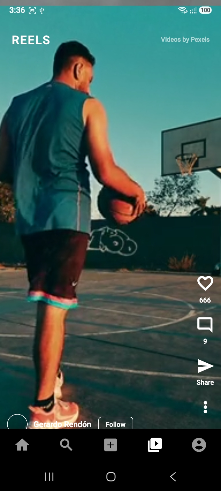
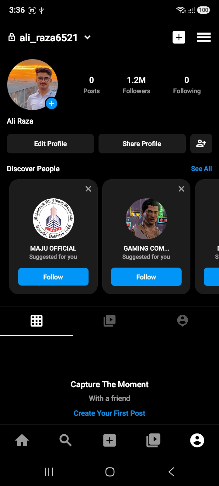
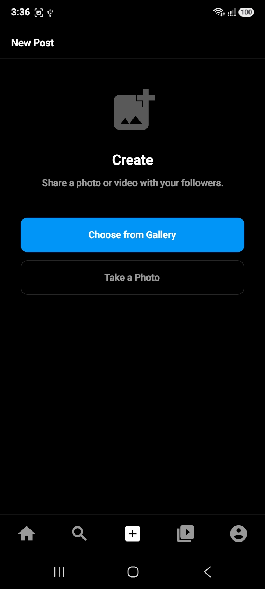
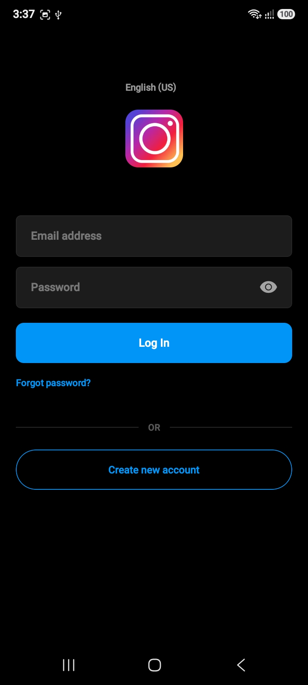

<h1 align="center">📸 Instagram Clone</h1>

<h3 align="center">A modern Instagram-style React Native mobile app — authenticate, browse photos, watch reels, search content, create posts, interact with media, and manage your profile with a production-inspired mobile architecture.</h3>

  

<i>Debug build — enable "Install from unknown sources" on Android if required.</i>

  
  
  
  

<h3 align="center">📸 Screenshots</h3>

  
  
  
  
  
  

<i>Instagram-style feed, search, reels, profile, and post creation experience.</i>

<h3 align="center">📱 What it does</h3>

<ul>
  <li>
    
🔐 <strong>Firebase Authentication</strong> — email/password sign up, login, password reset, validation, and logout.

  </li>
  <li>
    
🏠 <strong>Instagram-style Home Feed</strong> — curated photos from the Pexels API with stories, pagination, likes, comments, and post details.

  </li>
  <li>
    
🔍 <strong>Search</strong> — debounced Pexels image search with featured results, grid browsing, retry handling, and empty states.

  </li>
  <li>
    
➕ <strong>Create Post</strong> — choose an image from the gallery or capture one using the camera, add a caption, and create a local post.

  </li>
  <li>
    
🎬 <strong>Reels</strong> — full-screen vertical video feed powered by Pexels with autoplay, pause/play controls, likes, comments, and pagination.

  </li>
  <li>
    
❤️ <strong>Likes</strong> — post and reel likes are managed through Redux and persisted locally across app launches.

  </li>
  <li>
    
💬 <strong>Comments</strong> — reusable bottom-sheet comment interface for both posts and reels with emoji shortcuts and comment creation.

  </li>
  <li>
    
👤 <strong>Profile</strong> — Instagram-inspired profile screen with post count, followers/following sections, discover-people cards, and profile navigation.

  </li>
  <li>
    
⚙️ <strong>Settings & Privacy</strong> — account/settings-style screen with logout functionality and navigation back to authentication.

  </li>
</ul>

<h3 align="center">✨ Highlights</h3>

  
  
  
  

  <strong>Real authentication + real media APIs + persistent local state + Instagram-inspired UX</strong>

<h3 align="center">🛠️ Tech Stack</h3>

  
  
  
  
  
  
  
  

<h3 align="center">🏗️ Architecture</h3>

The application follows a layered React Native architecture designed around navigation, screen-level features, reusable components, remote API services, and centralized local state.

<ul>
  <li>
    <strong>App Shell</strong> — Redux, Redux Persist, and Safe Area context wrap the application before rendering the navigation tree.
  </li>
  <li>
    <strong>Navigation</strong> — stack navigation handles authentication and detail screens while bottom tabs provide access to the main application areas.
  </li>
  <li>
    <strong>Feature Screens</strong> — authentication, feed, search, add post, reels, profile, settings, followers/following, and post details.
  </li>
  <li>
    <strong>Shared Components</strong> — reusable post cards, stories, modals, and comments UI.
  </li>
  <li>
    <strong>State Management</strong> — Redux Toolkit manages likes and user-created posts, with Redux Persist providing local persistence.
  </li>
  <li>
    <strong>Remote Media</strong> — Pexels provides photos for the feed/search experience and videos for reels.
  </li>
</ul>

<h3 align="center">🧭 Navigation</h3>

The application combines a root stack navigator with bottom tab navigation.

<ul>
  <li><strong>Login</strong></li>
  <li><strong>Sign Up</strong></li>
  <li><strong>Main Application</strong></li>
  <li><strong>Drawer / Settings</strong></li>
  <li><strong>Followers / Following</strong></li>
  <li><strong>Post Detail</strong></li>
</ul>

The main bottom navigation contains:

<ul>
  <li>🏠 Feed</li>
  <li>🔍 Search</li>
  <li>➕ Add</li>
  <li>🎬 Reels</li>
  <li>👤 Profile</li>
</ul>

<h3 align="center">📂 Project Structure</h3>

<pre>
src/
  api/
    PexelsClient.ts

  components/
    PostItem.tsx
    StoryItem.tsx

  config/
    env.ts

  modals/
    AppModal.js
    CommentModal/

  navigation/
    AppNavigator.tsx
    BottomTabs.tsx

  screens/
    LoginScreen/
    SignUpScreen/
    HomeScreen/
    SearchScreen/
    AddScreen/
    ReelsScreen/
    ProfileScreen/
    DrawerScreen/
    FollowListScreen/
    PostDetailScreen/

  services/
    FeedService.ts
    ReelsService.ts

  store/
    index.js
    likesSlice.js
    postsSlice.js
</pre>

<h3 align="center">🔐 Authentication</h3>

Authentication is handled using Firebase Authentication with an email/password flow.

<ul>
  <li>📧 Email/password sign in</li>
  <li>📝 Account creation</li>
  <li>🔑 Password reset email</li>
  <li>👁️ Password visibility toggle</li>
  <li>⚠️ Firebase error handling</li>
  <li>🚪 Firebase logout</li>
</ul>

The authentication screens also include password validation, confirmation fields, modal-based feedback, and navigation into the main application after successful authentication.

<h3 align="center">🏠 Home Feed</h3>

The home feed recreates the familiar Instagram browsing experience with a horizontal stories section followed by a vertically scrolling photo feed.

<ul>
  <li>📸 Pexels-powered photo content</li>
  <li>⭕ Instagram-style stories</li>
  <li>❤️ Persistent likes</li>
  <li>💬 Comment interactions</li>
  <li>📄 Post detail navigation</li>
  <li>🔄 Pagination / load-more behavior</li>
  <li>©️ Pexels attribution</li>
</ul>

<h3 align="center">🔍 Search</h3>

The search experience uses the Pexels API to provide a responsive image discovery experience.

<ul>
  <li>⌨️ Debounced search queries</li>
  <li>⏱️ 600ms search delay to reduce unnecessary API requests</li>
  <li>🖼️ Featured search result</li>
  <li>🔲 Grid-based image results</li>
  <li>🧹 Clear search functionality</li>
  <li>🔁 Retry on API errors</li>
</ul>

<h3 align="center">➕ Create Post</h3>

The Add screen provides a complete UI flow for creating a local post.

<ul>
  <li>📷 Capture an image using the camera</li>
  <li>🖼️ Select an image from the gallery</li>
  <li>👀 Preview the selected image</li>
  <li>✍️ Add a caption</li>
  <li>📤 Share the post</li>
  <li>💾 Persist the created post through Redux Persist</li>
  <li>✅ Success and error feedback through reusable modals</li>
</ul>

<h3 align="center">🎬 Reels</h3>

The Reels screen provides a full-screen vertical video experience using portrait and lifestyle videos supplied by Pexels.

<ul>
  <li>▶️ Automatic playback based on visibility</li>
  <li>⏸️ Tap-to-pause / play</li>
  <li>❤️ Reel likes</li>
  <li>💬 Reel comments</li>
  <li>📱 Full-screen vertical video layout</li>
  <li>📜 Load-more behavior while scrolling</li>
  <li>🎥 React Native Video playback</li>
</ul>

<h3 align="center">👤 Profile</h3>

The profile screen recreates an Instagram-inspired account page while combining dynamic local state with mock profile data.

<ul>
  <li>👤 Profile information</li>
  <li>📊 Dynamic locally-created post count</li>
  <li>👥 Followers and following sections</li>
  <li>🔎 Discover people cards</li>
  <li>➕ Quick access to creating posts</li>
  <li>⚙️ Access to settings/privacy</li>
  <li>📑 Posts, reels, and tagged content tabs</li>
</ul>

<h3 align="center">❤️ State Management</h3>

Redux Toolkit is used to manage the application's locally persistent interaction state.

<ul>
  <li><strong>Likes Slice</strong> — stores liked posts and reels.</li>
  <li><strong>Posts Slice</strong> — stores user-created posts and the local post count.</li>
  <li><strong>Redux Persist</strong> — persists selected Redux state using AsyncStorage.</li>
</ul>

This means likes and locally-created posts can survive an application restart without requiring a backend database.

<h3 align="center">🧩 Reusable Components</h3>

<h4>PostItem</h4>

The central reusable post component used by the feed and post detail screen.

<ul>
  <li>User avatar and name</li>
  <li>Optional location and verification badge</li>
  <li>Post image</li>
  <li>Like interaction</li>
  <li>Comment interaction</li>
  <li>Caption and comment count</li>
</ul>

<h4>StoryItem</h4>

Reusable story bubble component responsible for Instagram-style circular story presentation and the "Your Story" indicator.

<h4>AppModal</h4>

A shared modal component used for informational, success, and error feedback throughout authentication, post creation, and logout flows.

<h4>CommentModal</h4>

A reusable bottom-sheet comments interface shared between posts and reels, supporting existing comments, emoji shortcuts, and new comment creation.

<h3 align="center">🔄 Data Flow</h3>

<pre>
Firebase Authentication
        │
        ▼
  Login / Sign Up
        │
        ▼
   Main Application
        │
 ┌──────┼────────┬──────────┐
 ▼      ▼        ▼          ▼
Feed  Search    Reels     Profile
 │      │        │          │
 └──────┴────────┴──────────┘
              │
              ▼
          Pexels API

User-created posts ──► Redux ──► Redux Persist
Likes ───────────────► Redux ──► Redux Persist

Comments ────────────► Local Component State
Followers/Following ─► Mock Local Data
</pre>

<h3 align="center">⚠️ Important Limitations</h3>

This project intentionally focuses on demonstrating a realistic social-media UI and React Native architecture rather than implementing a complete production social network.

<ul>
  <li>⚠️ <strong>No production social backend</strong> — posts, comments, followers, and profile data are not backed by a dedicated social-media database.</li>
  <li>💾 <strong>Posts are local</strong> — user-created posts are stored through Redux Persist and are not uploaded to a remote server.</li>
  <li>📤 <strong>Upload is simulated</strong> — the Add Post flow simulates an upload rather than uploading media to Firebase Storage.</li>
  <li>🏠 <strong>Created posts do not enter the Pexels feed</strong> — the home feed currently displays Pexels content only.</li>
  <li>💬 <strong>Comments are not persisted</strong> — comments exist in local component state.</li>
  <li>👥 <strong>Followers/following are mock data</strong> — follow state is local and is not connected to a backend.</li>
  <li>🔍 <strong>Search uses Pexels</strong> — search results represent external Pexels media rather than a user-generated social feed.</li>
  <li>⚙️ <strong>Settings is not a native drawer navigator</strong> — the current settings/privacy experience is implemented as a stack screen.</li>
  <li>🔐 <strong>Authentication state is not centrally guarded on launch</strong> — the current navigation flow does not appear to use a dedicated Firebase auth-state listener for automatic route restoration.</li>
  <li>🧪 <strong>Testing is limited</strong> — the project currently contains a basic smoke test rather than comprehensive automated test coverage.</li>
</ul>

<h3 align="center">🔧 Configuration</h3>

The Pexels integration requires a valid API key. The project expects the Pexels configuration through:

<pre>
src/config/env.ts
</pre>

Make sure the required Pexels credentials are configured before running the application. Without a valid Pexels API key, the feed, search, and reels features cannot retrieve their remote media.

<h3 align="center">🚀 Future Improvements</h3>

The current architecture provides a strong foundation for evolving the project into a more complete social application.

<ul>
  <li>☁️ Upload user media to Firebase Storage</li>
  <li>🗄️ Store posts and comments in Firestore</li>
  <li>👥 Implement real follower/following relationships</li>
  <li>🔄 Merge user-created posts with the remote feed</li>
  <li>🔐 Add a centralized Firebase authentication state listener</li>
  <li>💬 Persist comments remotely</li>
  <li>❤️ Synchronize likes with a backend</li>
  <li>🔔 Add notifications</li>
  <li>📩 Add direct messaging</li>
  <li>🧪 Expand unit and integration test coverage</li>
</ul>

<h3 align="center">🎯 Project Purpose</h3>

  <strong>Built as a React Native learning, portfolio, and UI/UX project inspired by Instagram.</strong>

  The project demonstrates how a mobile social-media experience can combine real authentication,
  external media APIs, local persistence, video playback, reusable components, and structured navigation.

<h3 align="center">📚 What I Learned</h3>

<ul>
  <li>Building multi-screen React Native applications with React Navigation</li>
  <li>Implementing Firebase email/password authentication</li>
  <li>Integrating REST APIs for remote image and video content</li>
  <li>Managing application state with Redux Toolkit</li>
  <li>Persisting local state using Redux Persist and AsyncStorage</li>
  <li>Building reusable post, story, modal, and comment components</li>
  <li>Implementing vertical video feeds with React Native Video</li>
  <li>Working with camera and gallery media selection</li>
  <li>Designing Instagram-inspired mobile interfaces and interaction patterns</li>
</ul>

<h3 align="center">📬 Contact</h3>

  

  

  

  ⭐ If you found this project interesting, feel free to explore the code and give the repository a star!

